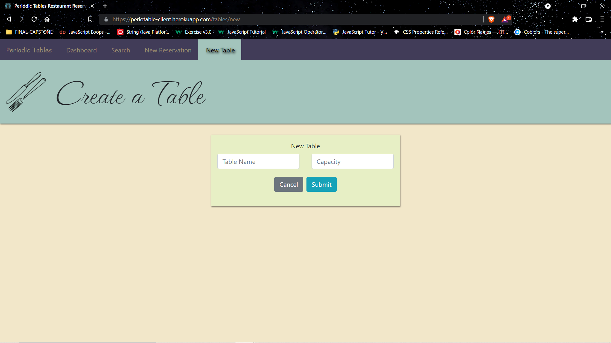
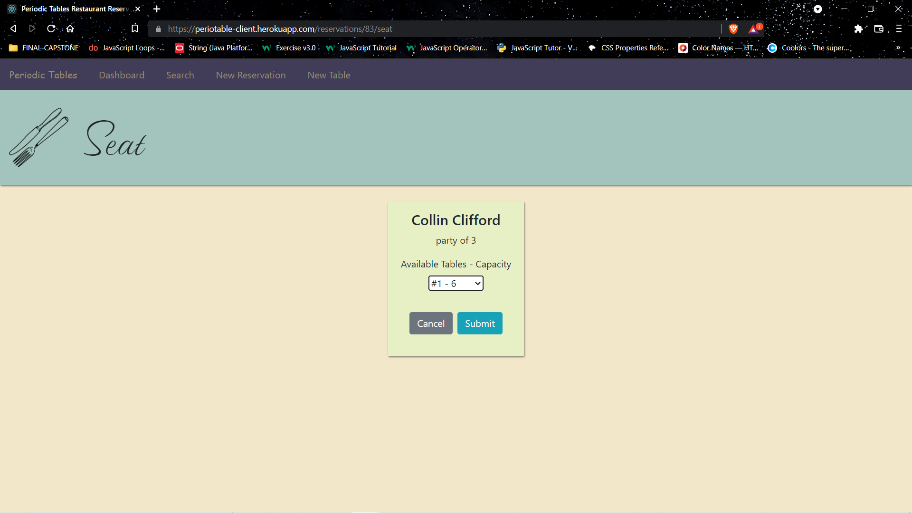

# Periodic Tables Restaurant Reservation System

This is a restaurant Reservation Application that I developed that to demonstrate my React.js, Express.js, Knex, Css, PostgreSQL, and Node.js capabilities.

The website allows restaurants to
- create, update or delete Reservations
- create tables
- assign reservations to tables
- search for reservations in the database

It is a comprehensive and easy to use website to allow restaurants to spend less time bookkeeping and more time on customer experience.
The database was created with Express.js, migrated using Knex and deployed through Heroku.  It uses RESTful API guidelines and the PostgreSQL system.  
The client facing side of the application was built with React.js and Reacter Router, stylized with Vanilla CSS with a little help from popular framework Bootstrap.

[Link to Deployed Website](https://periotable-client.herokuapp.com/)

## Dashboard

Where users can see which reservations are set for a certain day and have the capability to Cancel, Edit, or Seat Reservation to select Table.

## Create a Reservation

Where users can create a new reservation

## Create Table

Where users can create new tables

## Seat Reservation

Where users can seat reservation at a selected Table

## Edit Reservation

Where users can edit previously created reservations

## Search Reservations

Where users can find reservations that have been submitted, whether they are booked, seated, finished, or cancelled

## Installation Instructions
- Fork and clone this repository.
- Run cp ./back-end/.env.sample ./back-end/.env.
- Update the ./back-end/.env file with the connection URL's to your ElephantSQL database instance.
- Run cp ./front-end/.env.sample ./front-end/.env.
- You should not need to make changes to the ./front-end/.env file unless you want to connect to a backend at a location other than http://localhost:5000.
- Run npm install to install project dependencies.
- Run npm run start:dev to start your server in development mode.
